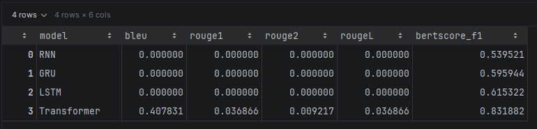
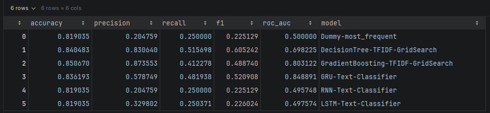
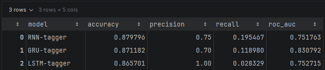

# Отчёт по итоговому проекту по курсу «Инженерия Искусственного Интеллекта»

> Рекомендуемый объём отчёта: 3-5 страниц в эквиваленте Markdown/печатного текста.  
> Отчёт должен позволить преподавателю понять задачу, данные, выбранные модели и результаты экспериментов.

---

## 1. Паспорт проекта

- **Название проекта:** `AI Detox Service`
- **Автор:** `Самончев Константин Петрович`
- **Группа:** `ЭФБО-03-24`
- **Контакт:** `konstantin.samonchev@gmail.com`
- **Ссылка на репозиторий:** `https://github.com/Larembra/AIE_DPO`

Проект "AI Detox Service" направлен на автоматическую детекцию и корректировку токсичных сообщений на русском языке. Он объединяет мультиклассовый классификатор типа токсичности, модель-тэггер выделения токсичных токенов (spans) и трансформерный генератор для получения «детокс»-версии текста. В результате целью является получение REST‑сервиса, который по входному сообщению возвращает метку токсичности, список токсичных слов и очищенную версию текста для интеграции в системы модерации.

---

## 2. Постановка задачи и контекст

1. **Предметная область и задача:**
   - Задача комбинированная: классификация (мультиклассовая классификация типа токсичности), sequence‑labeling (детекция токенов/спанов с токсичным содержимым) и генерация (seq2seq‑детокс‑генератор). Цель - автоматически обнаруживать и корректировать токсичные высказывания в тексте.
   - Потенциальные пользователи: команды модерации мессенджеров, форумов и других социальных сетей, интеграторы систем контент‑модерации.

2. **Формулировка задачи в терминах ML/ИИ:**
   - Основной вход — одиночный текст на русском языке (строка).
   - Для мультиклассового классификатора (toxicity classifier): выход - метки класса из множества {normal, insult, threat, obscenity}, для sequence‑labeling (spans): выход - бинарная метка на каждый токен (токсичный/нет), для генератора (detox generator): выход - очищенный текст.
   - Среди требований есть интерпретируемость: модель тэггинга возвращает конкретные токены как объяснение, а классификатор даёт вектор вероятностей - это повышает прозрачность принятого решения по сравнению с «чёрным ящиком» генератора, воспроизводимость: все ключевые гиперпараметры обучения и инференса хранятся в configs/, при обучении моделей сиды фиксируются, что упрощает воспроизведение и перенастройку без правки кода, так же есть ограничение на длину входного текста.

3. **Целевые метрики качества:**
   - Для мультиклассового классификатора и тэггера: accuracy, precision, recall, F1 и ROC‑AUC, для генератора детокс‑текста: BLEU/ROUGE и BERTScore F1.
   - Комбинация accuracy/precision/recall/F1/ROC‑AUC дают возможность оценить не только общую точность модели, но и устойчивость к дисбалансу классов и способность различать классы в целом, метрики BLEU/ROUGE и BERTScore F1 позволяют оценить качество генерации на лексическом, содержательном и семантическом уровне.

---

## 3. Данные

1. **Источник данных:**
   - Открытые датасеты: 
   - Paradetox (https://huggingface.co/datasets/s-nlp/ru_paradetox, Logacheva et al. (2022) - ParaDetox: Detoxification with Parallel Data, Dementieva et al. (2022) - RUSSE-2022: Findings of the First Russian Detoxification Shared Task Based on Parallel Corpora, Dementieva et al. (2024) - MultiParaDetox: Extending Text Detoxification with Parallel Data to New Languages).
   - Multilingual_toxic_spans (https://huggingface.co/datasets/textdetox/multilingual_toxic_spans, Multilingual and Explainable Text Detoxification with Parallel Corpora (Dementieva et al., 2025))
   - Toxic Russian Comments (https://www.kaggle.com/datasets/alexandersemiletov/toxic-russian-comments)

2. **Структура данных:**
   - При выполнении команд загрузки данных появляются файлы таблиц в project/data: multilabel_raw/multilabel_raw.csv, spans_raw/spans_raw.csv, detox_raw/train_raw.csv, detox_raw/val_raw.csv (исходные raw‑файлы); поддиректории: detox/, multilabel/, spans/ — каждая содержит train.csv, val.csv, test.csv (сплиты для соответствующих задач);
   - Ключевые признаки (колонки): для spans_raw.csv: Sentence - исходный текст (строка), Negative Connotations — строка с токсичными фрагментами; для multilabel_raw.csv: Text - исходный текст (строка), Normal, Insult, Threat, Obscenity — бинарные метки классов; для detox_raw/*.csv: ru_toxic_comment - исходный текст (строка), ru_neutral_comment - очищенный текст (строка);
   - Основной тип данных - текстовые данные (строки), также есть бинарные метки для задачи классификации (мультикласс). 

3. **Предобработка и EDA:**
   - Основные шаги предобработки: очистка и дедупликация данных, токенизация регулярным выражением (src/features/text.py::tokenize), построение словаря word2idx и преобразование текстов в индексы (src/models/utils.py::build_word2idx_from_texts, texts_to_sequences), padding/truncation до max_len (см. configs/*/inference_params.json), сохранение результирующих артефактов в project/artifacts/.;
   - Важные наблюдения из EDA: выраженная несбалансированность классов, большая вариативность длины сообщений и высокий уровень шума/слэнга/мата, частые многословные спаны и списковые поля, наличие выбросов и дублей (требовалась дедупликация) и очевидная потребность в калибровке порогов для spans и вероятностей классификатора; подробности и визуализации — в notebooks/EDA/.

Основные шаги EDA и подготовки данных для трех датасетов лежат в project/notebooks/EDA/.

---

## 4. Модели и подходы

1. **Базовые (baseline) модели:**
   - В качестве baseline использовались простые стратегии и классические ML‑пайплайны — DummyClassifier (most_frequent), TF‑IDF + DecisionTree, TF‑IDF + HistGradientBoosting, плюс эксперименты с LogisticRegression и LinearSVC (например, реализация и подбор параметров в notebooks/model_testing/toxic_multilabel_model.ipynb).
   - Baseline‑методы дали контрольную (низкую/среднюю) точку по F1/precision/recall/ROC‑AUC — они были заметно хуже, чем RNN/GRU/LSTM‑модели, подробные значения и сравнение моделей можно найти в файлах из notebooks/model_testing/.

2. **Улучшенные модели и эксперименты:**
   - В проекте реализованы и протестированы нейросетевые подходы: рекуррентные модели (GRU, LSTM, RNN) для мультиклассовой классификации (src/models/architectures.py, ноутбук notebooks/model_testing/toxic_multilabel_model.ipynb), задачи spans (эксперименты в notebooks/model_testing/toxic_spans_model.ipynb) и генерации (эксперименты в notebooks/model_testing/detox_model.ipynb).
   - Ключевые гиперпараметры вынесены в configs/*/*.json и в ноутбуках: embed_dim, vocab_size, hidden_size, num_layers, dropout для RNN/GRU/LSTM; lr, batch_size, epochs, optimizer (AdamW) и weight_decay для обучения; для spans/классификатора - max_len и порог threshold на уровне инференса; для детокс‑трансформера - beam_width, max_len.
   - В ноутбуках выполнен набор экспериментов по подбору гиперпараметров (например max_depth, min_samples_leaf для деревьев в notebooks/model_testing/toxic_multilabel_model.ipynb), архитектуры итоговой модели, регуляризации (dropount, ReduceLROnPlateau).

3. **Нейросетевые модели:**
   - В проекте реализованы и протестированы нейросетевые подходы: рекуррентные модели (GRU, LSTM, RNN) и трансформер cointegrated/rut5-small (https://huggingface.co/cointegrated/rut5-small в notebooks/model_testing/detox_model.ipynb) для детокс-генерации.
   - Конкретные настройки обучения вынесены в configs/*/train_params.json, там указаны lr, batch_size, epochs, optimizer (AdamW) и weight_decay для обучения; для spans/классификатора - max_len и порог threshold на уровне инференса; для детокс‑трансформера - beam_width, max_len.

---

## 5. Экспериментальный протокол и результаты

1. **Экспериментальный протокол:**
   - Как делится выборка: в ноутбуке notebooks/model_testing/toxic_multilabel_model.ipynb данные (после очистки) уменьшались (в примере берётся 1/10 для ускорения), затем деление выполнялось в соотношении train/val/test = 70/15/15; использовался MultilabelStratifiedShuffleSplit/MultilabelStratifiedKFold для мульти‑лейбловой стратификации, для отдельных классических моделей (DecisionTree / HistGradientBoosting) применялся GridSearchCV с cv=3 при поиске гиперпараметров.
   - Как считали метрики / где вычисляли: во время обучения метрики контролировались на валидационной выборке (val) — на ней считался val_loss и прочие метрики, применялись ранняя остановка и scheduler (например ReduceLROnPlateau) и сохранялось лучшее состояние модели по val; окончательные метрики рассчитывались на отложенной выборке (test) и сохранялись в JSON в project/artifacts.

2. **Сравнение моделей по метрикам:**

   notebooks/model_testing/detox_model.ipynb:
   
   

   notebooks/model_testing/toxic_multilabel_model.ipynb:

   

   notebooks/model_testing/toxic_spans_model.ipynb:
   
   

3. **Выбор финальной модели:**
   - Финальные модели: GRU-классификатор для определения типа токсичности, GRU-тэггер для выделения спанов выбраны по максимальной roc-auc, трансформер (cointegrated/rut5-small) для генерации детокс-текста выбран по максимальной bertscore_f1. Выбор обусловлен способностью моделей различать классы и положительные/отрицательные пороги в целом, а также качество генерации на семантическом уровне (совпадении текста по смыслу).
   - Trade-off’ы - скорость и ресурсы против качества (трансформер требует GPU и даёт большую задержку) и precision vs recall при подборе порогов для тэггера/классификатора.

---

## 6. Архитектура решения и сервис

1. **Архитектура пайплайна:**
   - Данные загружаются из project/data (raw), проходят очистку/дедупликацию и токенизацию в модуле предобработки (src/features), затем преобразуются в индексы и сплиты train/val/test для обучения моделей (multilabel classifier, spans tagger, detox generator), лучшие веса и конфиги сохраняются в project/artifacts/configs, а сервис при запросе применяет ту же предобработку и последовательно выполняет классификацию, spans (для объяснения), опциональную генерацию детокс‑текста с последующей постобработкой и возвратом результата через REST‑endpoint.

2. **API и endpoints:**
   - /health (GET) — проверка жизнеспособности сервиса, возвращает статус сервиса:
{
  "status": "ok"
}
   - /ready (GET) — проверка готовности сервиса и загрузки моделей, возвращает состояние каждого компонента:
{
  "ready": true,
  "models": [
    {
      "name": "toxicity_classifier",
      "version": "1.0",
      "ready": true
    },
    {
      "name": "toxic_token_detector",
      "version": "1.2",
      "ready": true
    },
    {
      "name": "detox_generator",
      "version": "2.0",
      "ready": true
    }
  ]
}
   - /models (GET) — список доступных моделей и их версий:
{
  "models": [
    {
      "name": "toxicity_classifier",
      "version": "1.0"
    },
    {
      "name": "toxic_token_detector",
      "version": "1.2"
    }
  ]
}
   - /load_weights - команда перезагрузки весов моделей (используется для обновления артефактов без перезапуска сервиса), возвращает статус операции:
{
  "status": "ok"
}
   - /detox (POST) — основной endpoint для детекции и детоксикации; принимает текст и возвращает тип токсичности, список токсичных слов и очищенную версию текста (пример): Request:
{
  "text": "ты тупой идиот"
}
Response:
{
  "toxicity_type": "insult",
  "toxic_words": [
    "тупой",
    "идиот"
  ],
  "detox_text": "ты неправ"
}

3. **Технологический стек:**
   - Используются FastAPI/uvicorn, PyTorch (torch), transformers + tokenizers/sentencepiece, datasets/evaluate/bertscore, scikit‑learn, numpy/pandas, pydantic, joblib, matplotlib/seaborn.
   - Docker не используется, команды для поднятия сервиса описаны в project/README.md.

---

## 7. Наблюдаемость, конфигурация и безопасность

Кратко опишите:

1. **Логи и наблюдаемость:**
   - Логируется: логи запросов и ответов, ошибки, предупреждения и критические события, события загрузки/перезагрузки весов и ключевые метрики инференса (модель, версия, score, threshold) логируются в консоль с помощью logging.
   - Проверить корректность работы: быстрый чек /health и /ready (статусы моделей), дополнительно можно сделать прогон автоматизированных тестов через pytest (тесты в project/tests)

2. **Конфигурации:**
   - В configs/ хранятся JSON‑файлы (например hyperparams.json, train_params.json, inference_params.json в подпапках detox_model/, multilabel_model/, spans_model/), содержащие параметры моделей и обучения (embed_dim, vocab_size, hidden_size, num_layers, dropout, lr, batch_size, epochs, optimizer, weight_decay и т.д.), параметры инференса (max_len, threshold, beam_width, bos_id/eos_id), настройки TF‑IDF/feature‑engineering и пути к артефактам; есть также .env.example с переменными окружения (KAGGLE_USERNAME, KAGGLE_KEY) для загрузки данных из Kaggle.
   - Без изменения кода можно перенастроить параметры инференса, параметры обучения и гиперпараметры моделей.

3. **Безопасность:**
   - Секреты не коммитились: реальные ключи от Kaggle хранятся локально в папке .kaggle (не в проекте), при этом в .gitignore присутствует .env.
   - В репозитории нет закоммиченных секретов или приватных ключей - в проекте лежат только публичные датасеты и артефакты.

---

## 8. Ограничения и дальнейшая работа

- Наборы частично небольшие, шумные и частично разметочно-конфликтные, сильный дисбаланс классов и много слэнга/морфоформ русского языка; инфраструктура: сервис пока не имеет фронтенда, логики авторизации.
- Я бы улучшил обучение моделей, метрики низкие, а еще бы упаковал в Docker.

---

## 9. Сценарий демонстрации на защите

1. Что вы **запускаете**:
   - Запускаю сервис через `python -m service`, показываю пару запросов через Swagger UI (http://localhost:8000/docs) и демонстрирую работу на примере реальных/демонстрационных данных из датасета (например, беру токсичное сообщение из тестовой выборки и показываю результат детекции и детоксикации).
2. Какие **1-2 ключевых сценария** вы показываете:
   - пример запроса к `/detox`;
   - пример работы с реальными/демонстрационными данными;
3. На что хотите, чтобы преподаватель обратил внимание:
   - качество предсказаний;
   - удобство API;
   - скорость предсказаний.

---
